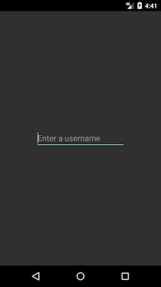
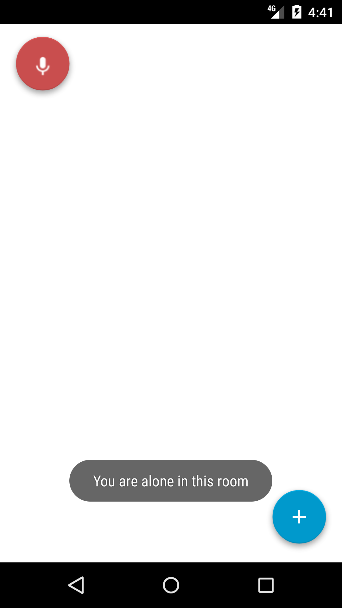
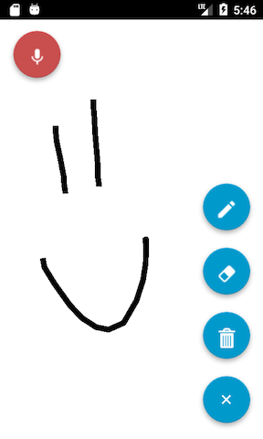

## whiteboard-android [CS 3714 - Final Project]

#### Google Play Store
[Collaboard](https://play.google.com/store/apps/details?id=com.vinnyoodles.vincent.whiteboardclient&hl=en)

#### Project Requirements

- [x] Communication via network. This could be accomplished over Bluetooth/Wifi/4G. The core idea here is that you send and receive data and, thus, implement long running operations.
- [x] Persistence. Your app needs to use some form of persistent storage (Some examples: SQLite, File, SharedPreferences, saveInstanceState callbacks).
- [x] Background operations. You must use background threads (AsyncTask, Thread or any other variants) to execute long running tasks.
- [x] Service. Your app should have a Service that will continue running in the background after you exit the activity.
- [x] Retained fragment. As your project app is going to contain long running operations, you must use retained fragments to retain references to those long running operations.
- [x] BroadcastReceivers. You will need to use at least one BroadcastReceiver to pass/receive information (Example: ON_BOOT to launch your background service).
- [x] Fragments. Use at least two fragments to display UI and manage them from within the containing activity.
- [x] Location. You can use either LocationManager or Google Play Services to retrieve location.
- [x] Camera/multimedia/audio. You can capture/play/edit photo/video/audio.

#### Screenshots

